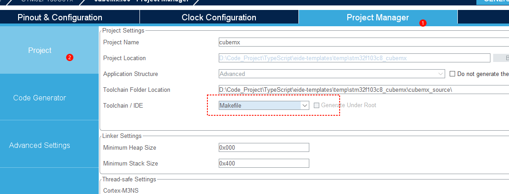
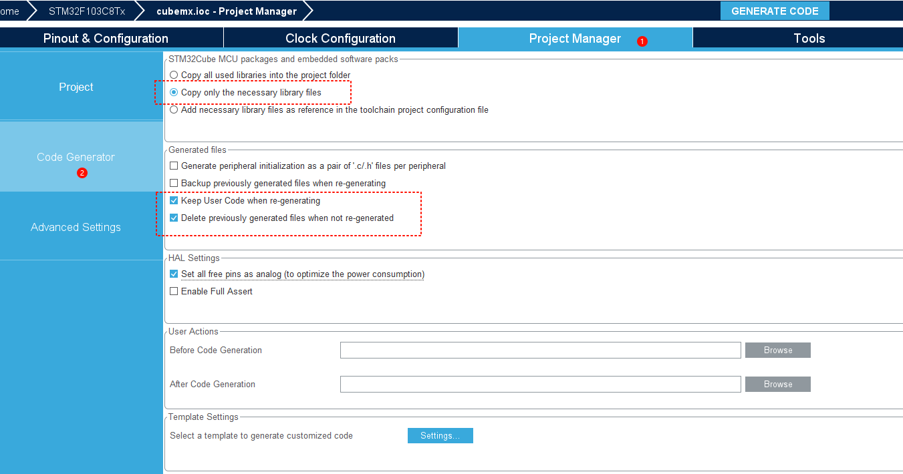
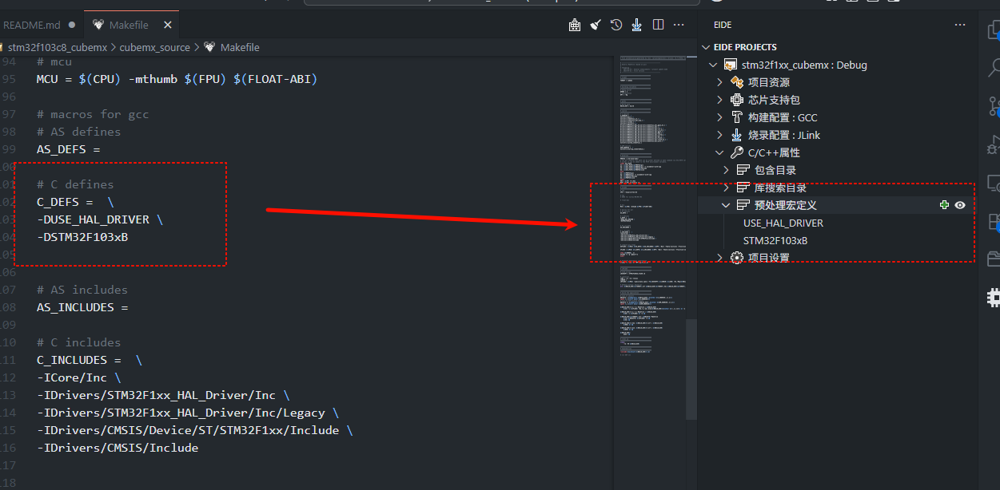
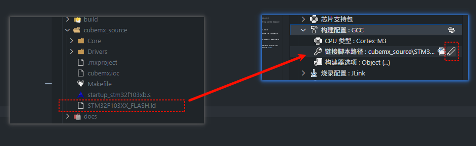
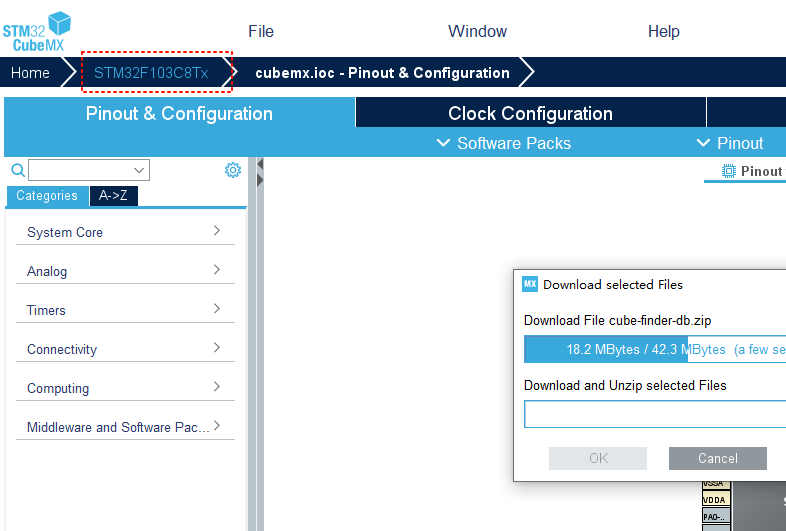
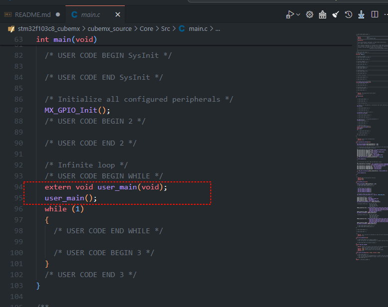
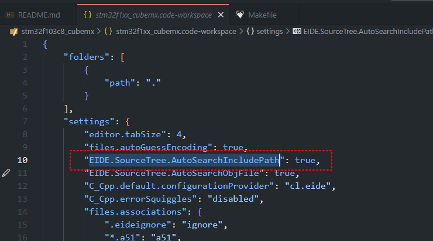

# STM32F1xx HAL 项目模板

这是适用于 STM32F1xx 的 HAL 库项目模板，同时该模板使用 STM32CubeMX 生成外设的初始化代码

项目信息：

- 编译器：arm-none-eabi-gcc
- 烧录器：JLink
- 代码生成工具：[STM32CubeMX v6.15.0](https://www.st.com.cn/zh/development-tools/stm32cubemx.html)

以上工具需要预先安装，请自行下载

例程功能：GPIO 翻转，引脚：PC13

## STM32CubeMX 配置

> 以下的所有操作该项目模板中已经配置好了，无需再操作

双击 `cubemx_source` 目录下的 cubemx.ioc 文件启动 STM32CubeMX 工具

1. 找到 Project 配置项，将 Toolchain 选择为 Makefile

    

2. 找到 Code Generator 配置项，按照如下图所示进行配置

    

    该配置使得 STM32CubeMX 不要生成多余的文件到目录中，避免编译不需要的文件而导致出错

3. 点击右上角的 **GENERATE CODE** 生成代码

4. 打开 `cubemx_source` 目录下的 `Makefile` 文件，将其中的 C_Defines 内容复制到 eide 插件的 预处理宏定义中

    注意复制的时候要去除掉 `-D` 前缀

    

5. 将 `cubemx_source` 目录下的 *.ld 文件的相对路径复制一下，然后填写到编译配置中的 **链接脚本路径** 设置项中，如下图所示

    

完成上述步骤后，一切就绪，现在可以执行编译了。

> 注意：工程根目录下的 `app.c` 已通过 Makefile 中的 `../app.c` 与 `-I..` 纳入 make 构建（供 CI 使用），
> 使用 STM32CubeMX 重新生成代码会覆盖 Makefile，需要重新加上这两处。

## 持续集成（CI）

工程内置 GitHub Actions 工作流 `.github/workflows/build.yml`，每次 push / pull request 会自动执行：

1. 在 Ubuntu 上安装 `gcc-arm-none-eabi` 工具链
2. 执行 `make` 编译固件
3. 上传 `cubemx.elf / cubemx.hex / cubemx.bin` 构建产物

将仓库推送到 GitHub 即可生效。

## 发布固件（Release）

当推送 `v*` 格式的 tag（如 `git tag v1.0.0 && git push --tags`）时，CI 会自动在 GitHub Releases 页面创建版本，并附带本次编译的 `cubemx.elf / cubemx.hex / cubemx.bin`，无需本地工具链即可获取固件。

## 更换芯片

该项目模板默认是 STM32F103C8，如果你正在使用其他的芯片，请点击如图所示按钮更换芯片



STM32CubeMX 更换芯片会导致 cubemx 工程被重置，因此你需要按照上一步 **"STM32CubeMX 配置"** 中的步骤重新配置

## 编码建议

不要直接在 main.c 中编写我们的代码，因为 STM32CubeMX 可能会覆盖该文件，即使你的代码是位于这样的注释块中。
```c
/* USER CODE BEGIN 2 */

/* USER CODE END 2 */
```
某些时候当你修改某些生成设置时，它可能会删除 main.c 而导致你的代码丢失。这是无法撤销的，除非你使用了git

我们可以将我们自己的代码放置在工程的根目录下，然后在 main.c 中调用我们的入口函数 `user_main`

app.c
```c
#include "app.h"

void user_main()
{
    while (1) {
        HAL_GPIO_TogglePin(LED_GPIO_Port, LED_Pin);
        HAL_Delay(500);
    }
}
```



## 特定于工程的插件配置

> 要修改 特定于工程的插件配置，请打开工程根目录下的 `.code-workspace` 文件进行修改。

该项目模板开启了一个特殊的 eide 设置项 `EIDE.SourceTree.AutoSearchIncludePath` 该设置使得 eide 能够自动搜索源文件夹内的 IncludePath, 

这对于 CubeMX 项目来说十分有用，我们可以开启该设置，这样可以不用手动去设置 `包含目录` 配置项，插件会自动完成 IncludePath 的添加


